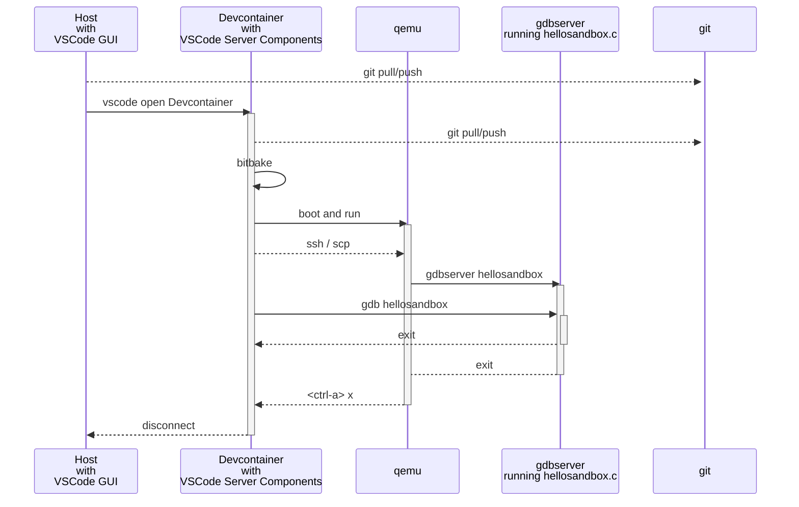

# Yocto 5.0 in devcontainer

This installation uses

* docker container based on `crops/yocto:debian-12`
* devcontainer

Positives
 * Compiles nicely
 * As vscode runs in devcontainer, all vscode extensions, also vscode-extension for bitbake and devtool run like a charm

Downsides
 * Dockerfile is a combination from https://github.com/crops/yocto-dockerfiles/blob/master/dockerfiles/debian/debian-12/debian-12-base/Dockerfile and `mcr.microsoft.com/devcontainers/base:bookworm`.

## Requirements

* Debian/Ubuntu/WSL
* Docker
* 70GBytes of disk space
* 32GBytes RAM

Time required to build the image

* 8h on Intel(R) Core(TM) i7-1165G7 @ 2.80GHz
* 1.5h oon Intel(R) Xeon(R) E-2146G CPU @ 3.50GHz
* Data
  * 60G build
  * 5.2G downloads
  * 90M sources

## Big picture

## Features

### yocto-bitbake

* Seems to work fine

### qemu

* The image may be started in qemu.

Details see [README_qemu.md](README_qemu.md)

### ssh into qemu

* SLIP is used and therefor no root rights are required.
* ssh connection (without password/prompts) to qemu.

Details see: [README_ssh.md](README_ssh.md)

### devtool

Seems to work.

### hellosandbox.c and remote debugging

* There is a custom layer and a hellosandbox.c application.
* Remote debugging tested from the command line and from vscode debugger.
  * Spoiler: The setup is quite tricky as many path have to be provied.

Details see: [README_hellosandbox.md](README_hellosandbox.md)

## Features intentially NOT supported

* qmu - graphical interface
* Toaster
* KAS https://kas.readthedocs.io/en/latest

## Implementation of [.devcontainer/Dockerfile](.devcontainer/Dockerfile)

This dockerfile is based on
* https://github.com/crops/yocto-dockerfiles/blob/master/dockerfiles/debian/debian-12/debian-12-base/Dockerfile

But instead of using `debian-12` as base it used `mcr.microsoft.com/devcontainers/base:bookworm`

Links

* https://github.com/crops/yocto-dockerfiles
* https://github.com/crops/poky-container
